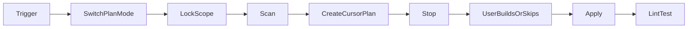

# tvscreener-rs housecleaning

Repo: `/opt3/tvscreener-rs`. Default scope: `src/` (lib, `src/bin/`, `src/tui/`, `src/mcp/`). Plus user-named paths such as `scripts/`, `examples/`, `tests/`, `docker/`.

Writing standard for comments/docs: user rule `code-comments-code-only` (code-oriented only; rustdoc on `pub` items). Also obey user rules `english-only`, `rust-clippy`, `kiss-fix-first`, and `no-em-dash`.

## Depth

| Trigger                                     | Blast radius                                                                                                   |
| ------------------------------------------- | -------------------------------------------------------------------------------------------------------------- |
| housecleaning / code health check / cleanup | Full health pass: aggressive review + improvements inside scope                                                |
| deep housecleaning / iron the codebase      | Same workflow; wider: cross-module duplication, constants ownership, module boundaries, organization/refactor |

Both modes are **plan-first**. Never edit source until the user **Builds** the Cursor Plan (or explicitly says apply / go / execute after the plan exists).

## Workflow (hard)

1. **Plan mode** - switch to Cursor **Plan** mode immediately. Do not stay in Agent and dump a cleanup list in chat.
2. **Scope** - user paths, or default `src/`. Do not leave scope. Do not invent a Docker/Hub/docs cleanup unless the user named those paths.
3. **Scan** - checklist below. Every finding is **DO** or **DON'T**. No optional, no nice-to-have, no "consider".
4. **Emit a real Cursor Plan** - create the plan artifact (CreatePlan / Plan UI) using the template. That plan is what the user reviews and may **Build** or discard.
5. **Stop.** Do not apply. Do not start edits. Short chat note only: plan is ready; Build to execute.
6. **Apply** - only after the user Builds the plan (or equivalent explicit go). Only approved DO items. Smallest correct diffs. No drive-by. Prefer fix-first over new parallel code (`kiss-fix-first.mdc`).
7. **Gates** - lint/test for every area in scope (see below). Failures are blockers. Prefer fixing **product code** over changing tests; edit a test only when the test itself is wrong (flaky assert, obsolete expectation). Never weaken or delete a test to make a DO item pass.
8. **No always-on restart duty** - this repo is a library + CLI/MCP/TUI. Do not invent an ITCy-style stack restart. If a user has a long-running `make run-mcp` / `make run-tui` session open, note they may need to restart it themselves.



### Plan delivery (hard)

- **Required:** a real **Cursor Plan** the user can Build or not.
- **Forbidden:** treating a markdown DO/DON'T dump in chat as the plan, or asking them to copy/paste instructions to apply.
- Chat may only point at the plan ("plan ready - Build to apply"). The actionable content lives in the Cursor Plan.

## Plan template (mandatory body of the Cursor Plan)

```markdown
# Housecleaning plan - <scope>

## DO

- path: what to change (why, one line)

## DON'T

- path or topic: why excluded (one line)

## Gates after apply

- lint/test commands for every area in scope
```

## Scan checklist

### Dead / unused

- unused imports, variables, functions, structs, enums, traits, types, constants, modules, binary helpers
- dead branches and unreachable helpers
- remove or wire; do not leave `#[allow(dead_code)]` (forbidden by `rust-clippy.mdc`)

### Duplication / organization

- duplicated logic across `src/` modules, bins, `src/tui/`, `src/mcp/` → one owner
- constants / URIs / path fragments / env key strings scattered → gather per concern into one module/file
- magic numbers; magic URL or URI fragments → named constants
- oversized functions → extract private helpers (do not add `#[allow(clippy::too_many_lines)]` or `too_many_arguments`)

### Rust (`src/`)

- duplicated handlers/helpers; functions too complex for readability
- missing rustdoc (`///`) on `pub` items in files under change → add code-oriented docs (`code-comments-code-only.mdc`)
- AI / product-prose / handoff / stage-label comments → delete or rewrite to code-only
- plan jargon (stage labels, Cursor plan IDs, piscine narrative) in code/comments → remove (allowlist is `.cursor/plans/*` only; see `github-public-quality.mdc`)
- French strings in code/docs → English (`english-only.mdc`); chat with Greg may stay FR
- em dash U+2014 anywhere touched → ASCII `-` / `:` / `|` (global no-em-dash rule)
- fix real clippy/fmt issues uncovered by `make lint` in code under change
- errors/tracing: prefer existing `TvscreenerError` / tracing patterns (`rust-errors-tracing.mdc`); do not invent a parallel error layer
- **Ignore (never DO, never busywork):** pure style churn that does not improve stability/readability; speculative "could be faster" rewrites without evidence

### Scripts / examples / tests (when in scope)

- dead scripts; duplicated shell helpers → one owner
- examples: keep runnable and English; no product marketing dump; no U+2014
- tests: fix harness/fixtures only when wrong; never weaken coverage to greenwash cleanup
- do not run live TradingView hits (`make test-live` / `--features live`) as part of housecleaning unless the user explicitly includes live tests

### Quality axes (rank DO items)

Stability and organization first. Then readability, maintainability, performance, security, scalability, portability/compatibility. Clever rewrites last.

## Hard bans

- **Do not break behavior.** Gates + targeted tests are the safety net.
- **No TradingView API contract / field-catalog rewrite** as housecleaning. Do not hand-edit `src/field/generated/` to "clean" it; regen is a separate maintainer task (`make regen-fields` / `regen` feature). Do not propose catalog cutovers under DO or DON'T.
- **Nothing regarding migration.** Forever out of scope. No migrate, no deprecate, no dual-path / old↔new bridges, no "compat shims until release," no versioned cutovers. Housecleaning cleans the current code in place; it does not stage a transition. Do not propose it. Do not list it under DO or DON'T. Do not discuss it.
- **Nothing optional.** DO or DON'T only.
- **No forbidden Clippy allows** (`dead_code`, `too_many_arguments`, `too_many_lines`).
- **Do not edit `.cursor/rules/`** (needs separate user consent). This skill under `.cursor/skills/` is fine.
- **Do not put host-absolute paths, screen recipes, or plan jargon into README / public docs / Makefile / scripts** (`github-public-quality.mdc`).
- **Do not open or merge PRs** as part of housecleaning unless the user explicitly asks for git/PR work after apply.

## Gates after apply

Lint first for what changed, then **full offline tests** for the housecleaning scope (not only the files you edited). Goal: catch regressions anywhere the cleanup could have touched.

| Touched / in scope | Lint                          | Full tests                         |
| ------------------ | ----------------------------- | ---------------------------------- |
| `src/` (default)   | `make lint` from repo root    | `make test` (offline) from root    |
| `scripts/` only    | exercise touched script; root `make lint` if product headers/scripts | `make test` if product behavior could move |
| `examples/` only   | `make lint`; build example if touched | `make test` if shared lib paths moved |
| `tests/` only      | `make lint`                   | `make test`                        |
| Default full scope | `make lint`                   | `make test`                        |

Do **not** require `make test-live` unless the user put live tests in scope.

### On test failure (hard)

1. Assume the **code** regressed. Fix the product code (or revert the DO item).
2. Change a test only when it is clearly the culprit (wrong assert, outdated fixture, broken harness).
3. Do not skip, mute, or narrow tests to greenwash a cleanup.

Treat gate failures as blockers. Do not claim done until full offline tests for in-scope areas pass.
